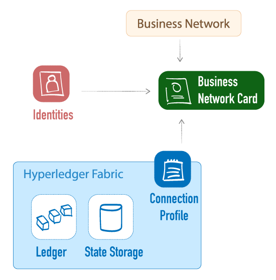
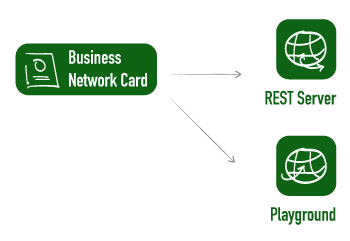

# Hyperledger Composer Architecture

## Hyperledger Composer Key Components
  


## Business Network


A **Business Network** includes:
- *Modeling language files (`models/.cto`)* to define models for Participants, Assets, Transactions and Events.
- *Transaction Logic (`lib/.js`)* to implement the logic of the transactions defined
- *Query file (`queries.qry`)* to design and enable complex queries on the Blockchain Data
- *Access Control File (`permissions.acl`)* to control visibility and actions on resources


## Business Network - Modeling language


Hyperledger Composer includes an object-oriented modeling language that is used to define the domain model for a business network definition.

This is used inside the `.cto` files and allows users to define resources, such as network participants, assets and transactions.

```
asset Tuna identified by tunaId {
  o String tunaId
  o Integer weight range=[500, 1000000]
  o FishStatus status default="CAUGHT"
  o DateTime catchTime
  --> Individual owner
}
```

It also features data validation of fields, simplifying and standardising their implementation:
```
o String firstName default 'NoName'
o String lastName optional
o String postcode regex=/(GIR 0AA)|((([A-Z-[QVf]][0-9][0-9]?)|(([A-Z-[QVf]][A-Z-[IJZ]][0-9][0-9]?)|(([A-Z-[QVf]][0-9][A-HJKPSTUW])|([A-Z-[QVf]][A-Z-[IJZ]][0-9][ABEHMNPRVWfY])))) [0-9][A-Z-[CIKMOV]]{2})/
```

## Business Network - Transaction Logic


The transactions are encoded under `lib/.js` with *JavaScript (JS)*, one of the most popular programming languages.
 
These  files define the actual logic to execute the transactions defined in the `.cto` files.

They can interact with *Participant Registries* and *Asset Registries* to create, update or delete instances of participants and assets.

```
async function sellTuna(tx) {
    // Get asset registry for Tuna
    const tunaRegistry = await getAssetRegistry(NS + '.Tuna');
    [...]
    await tunaRegistry.update(tx.tuna);
}
```

## Business Network - Queries


The *Query language* helps to define queries to retrieve information on the Blockchain using a *Structured Query Language (SQL)* type interface.

This can, for instance, enable complex queries that list all the assets of a participant that have been traded within a certain period, or retrieving assets owned by specific participants

```
query getTunaByParticipant {
   description: "List tuna owned by specific 'owner'"
   statement:
       SELECT org.tuna.Tuna
           WHERE (owner == _$owner)
               ORDER BY [catchTime ASC]
}
```

## Business Network - Access Control Rules


The *Access Control language* enables the simple definition of rules for accessing assets and transactions by different types of participant and identity.

For example, a rule may allow, for instance, a trader to access and transfer his own assets but allow an auditor *read-only access* to all assets on the network.

```
rule NetworkAdminSystem {
    description: "Grant business network administrators full access to system resources"
    participant: "org.hyperledger.composer.system.NetworkAdmin"
    operation: ALL
    resource: "org.hyperledger.composer.system.**"
    action: ALLOW
}
```

## Fabric Integration and Deployment



####  Identities
Composer also integrates a system for managing identities through the use of ID cards, which are mapped to a participants of the Business Network.
Using the *Identity*, the user of the Business Network can operate as that participant.

####  Connection Profile
The *connection profile* is a JSON Document that provides the information necessary to connect to a system (e.g. *Hyperledger Fabric* instance, including *CA*, *Orderers* and *Peers*).

####  Business Network Cards
*Business Network Cards* map all the above, combining identities, connection profiles and business network metadata.
They simplify the process of connecting to a business network.

## Deployment and test

There are two ways to access to the Business Network on Hyperledger Composer.

- **Composer Playground** provides a web-based test environment.
- **Composer REST Server** provides programmatic access to the Blockchain.


###  Composer Playground

[VIDEO In progress..]

###  REST Server
The *REST server* provided by Hyperledger Composer allows exposing the blockchain’s participants, assets, transactions and queries with a transparent *Application Programming Interface (API)*.

This makes it easy to integrate programmatic access to the Blockchain and to connect it to web or mobile application.

## Summary of Hyperledger Composer Key Components

