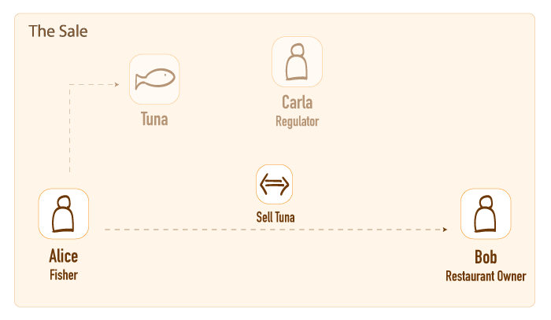
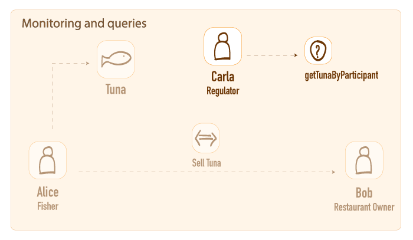
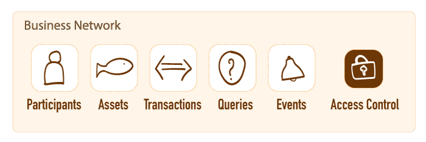
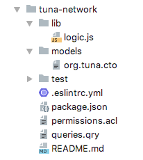
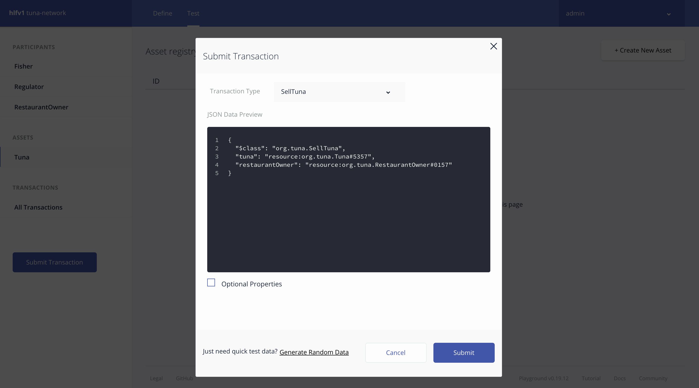
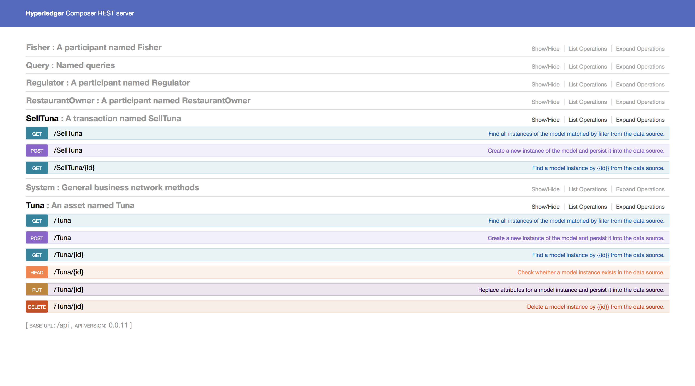

<!-- TOC depthFrom:1 depthTo:6 withLinks:1 updateOnSave:1 orderedList:0 -->

- [Introduction and Learning Objectives](#introduction-and-learning-objectives)
	- [Introduction to Hyperledger Composer](#introduction-to-hyperledger-composer)
	- [Learning Objectives](#learning-objectives)
- [Scenario](#scenario)
	- [Introduction to the Tuna fish example using Hyperledger Composer](#introduction-to-the-tuna-fish-example-using-hyperledger-composer)
	- [Participants](#participants)
	- [The Catch](#the-catch)
	- [The Sale](#the-sale)
	- [Monitoring and Queries](#monitoring-and-queries)
    - [Key benefits of using Hyperledger Composer](#key-benefits-of-using-hyperledger-composer)
- [Hyperledger Composer Architecture](#hyperledger-composer-architecture)
	- [Hyperledger Composer Key Components](#hyperledger-composer-key-components)
	- [Business Network](#business-network)
	- [Business Network - Modeling Language](#business-network---modeling-language)
	- [Business Network - Transaction Logic](#business-network---transaction-logic)
	- [Business Network - Queries](#business-network---queries)
	- [Business Network - Access Control Rules](#business-network---access-control-rules)
	- [Fabric Integration and Deployment](#fabric-integration-and-deployment)
	- [Deployment and test](#deployment-and-test)
	- [Summary of Hyperledger Composer Key Components](#summary-of-hyperledger-composer-key-components)
- [Installing Hyperledger Composer](#installing-hyperledger-composer)
	- [Technical Prerequisites - Ubuntu (Linux Virtual Machine)](#technical-prerequisites---ubuntu-linux-virtual-machine)
	- [Technical Prerequisites - Mac OS](#technical-prerequisites---mac-os)
	- [Installing Hyperledger Composer Components](#installing-hyperledger-composer-components)
	- [Install Hyperledger Fabric Development Server](#install-hyperledger-fabric-development-server)
	- [Starting Hyperledger Fabric and Composer Playground](#starting-hyperledger-fabric-and-composer-playground)
- [Writing and Deploying a Business Network](#writing-and-deploying-a-business-network)
	- [Overview of the Tuna Business Network](#overview-of-the-tuna-business-network)
	- [Steps](#steps)
	- [1) Creating an Empty Network](#1-creating-an-empty-network)
	- [2) Defining Participants](#2-defining-participants)
	- [3) Defining Assets and Transactions](#3-defining-assets-and-transactions)
	- [4) Developing Transaction Logic](#4-developing-transaction-logic)
	- [5) Developing Queries](#5-developing-queries)
	- [6) Defining Access Control Rules](#6-defining-access-control-rules)
	- [7) Building and starting the Business Network](#7-building-and-starting-the-business-network)
	- [8) Deploying onto Hyperledger Fabric](#8-deploying-onto-hyperledger-fabric)
	- [9) Testing on the Composer Playground](#9-testing-on-the-composer-playground)
	- [10) Running the Composer REST Server](#10-running-the-composer-rest-server)
- [Joining Hyperledger Composer Community](#joining-hyperledger-composer-community)
	- [Learning more about Hyperledger Composer](#learning-more-about-hyperledger-composer)
	- [Community Meetings and Mailing List](#community-meetings-and-mailing-list)
	- [Rocket.Chat and GitHub](#rocketchat-and-github)
- [Knowledge Check](#knowledge-check)
	- [Knowledge Check X.1](#knowledge-check-x1)
	- [Knowledge Check X.2](#knowledge-check-x2)
	- [Knowledge Check X.3](#knowledge-check-x3)
	- [Knowledge Check X.4](#knowledge-check-x4)
	- [Knowledge Check X.5](#knowledge-check-x5)
	- [Knowledge Check X.6](#knowledge-check-x6)
	- [Knowledge Check X.7](#knowledge-check-x7)
	- [Knowledge Check X.8](#knowledge-check-x8)
	- [Knowledge Check X.9](#knowledge-check-x9)
	- [Knowledge Check X.10](#knowledge-check-x10)
- [Conclusions and Learning Objectives (Review)](#conclusions-and-learning-objectives-review)
	- [Learning Objectives (Review)](#learning-objectives-review)
	- [Conclusions](#conclusions)

<!-- /TOC -->

# Introduction and Learning Objectives

## Introduction to Hyperledger Composer

> **VIDEO [EdX_0_Introduction.mp4]**
> Transcript:

> Hello everyone, I am Nicola and I am Sasha,
>
> we are the content creators for the Hyperledger Composer chapter.
>
> In this chapter we will guide you through a demo scenario to highlight the key components of Hyperledger Composer.
>
> Hyperledger Composer is a toolset and framework that has been designed to make it easier to prototype and integrate blockchain applications with existing business systems.
>
> In Hyperledger Composer you can develop and deploy a full-fledged Blockchain network.
>
> And use most of the functionality available to frameworks like Hyperledger Fabric.
>
> Hyperledger Composer provides domain-specific languages for Modeling, Query and Access Control that simplify the development.
>
> Also, visual components like Playground are helpful to communicate and visualise the structure and to test the interactions over the network.
>
> Then starting from the actual business requirements, technical and business individuals can work together to build blockchain applications using Hyperledger Composer.
>
> Today it works with the Hyperledger Fabric blockchain framework. However it has been designed with a view to supporting other frameworks down the road, such as Sawtooth, Iroha, etc.
>
> As you work through this section, you may want to find out more about Hyperledger Composer.
>
> There are resources you can check out, like GitHub, RocketChat and others.
>
> You will find the links at the end of this chapter.
>
> Let’s get into it!

## Learning Objectives

By the end of the chapter you should be able to:

* Understand the basics of Hyperledger Composer and how it interacts with Blockchain frameworks like Hyperledger Fabric.
* Walk through a demo scenario highlighting aspects of Hyperledger Composer.
* Discuss crucial components of Hyperledger Composer including Modeling language, Transaction Logic, Query language and Access Control.
* Install the developer environment, set up a running Business Network in Hyperledger Composer and deploy it locally on Hyperledger Fabric.
* Get involved in the community through Rocket Chat and GitHub.

# Scenario

## Introduction to the Tuna fish example using Hyperledger Composer

Hyperledger Composer provides a level of abstraction to build technical blockchain solutions over real use cases.

To best show what we can do with Hyperledger Composer, we will guide you through the steps to build a real case scenario.

It will be based on the Tuna-fish tracking system.


## Participants

There are three main participants:

* **Alice** is a Fisher who catches tuna.
* **Bob** is a Restaurant Owner who buys tuna from Alice.
* **Carla** is a Regulator monitoring that tuna has been legally and sustainably caught and resold.


## The Catch

When Alice catches a fish, she will create a record of the fish on the Hyperledger Fabric blockchain.


## The Sale

When Alice sells the fish to Bob, the transaction will be recorded on the Hyperledger Fabric.



## Monitoring and Queries

Alice, Bob or other participants like Carla can query the blockchain to retrieve specific information, such as the list transactions or the Tuna owned by specific Participants.



## Key benefits of using Hyperledger Composer

**Focusing on the problem**<br>
Develop blockchain application starting from the business requirements.

**Prototyping**<br>
Hyperledger Composer provides a smart tool  to revise and rearrange model and logic to build simple Proof of Concepts or MVPs.

**Analytics and Privacy**<br>
Rich queries on the data can be easily set up and performed. Access Control Rules help to preserve a layer of confidentiality for the business operations.

**Integration to existing systems**<br>
A REST server exposes your Blockchain to a Web or Mobile Application to be integrated in existing systems.

**Communication**<br>
Finally, Hyperledger Composer can be used to enhance the communication between business and technical teams to facilitate prototyping and development of the blockchain application.

# Hyperledger Composer Architecture

## Hyperledger Composer Key Components


## Business Network



A **Business Network** includes:
* *Modeling language files (`models/*.cto`)* to define models for Participants, Assets, Transactions and Events.
* *Transaction Logic (`lib/*.js`)* to implement the logic of the transactions defined
* *Query file (`queries.qry`)* to design and enable complex queries on the Blockchain Data
* *Access Control File (`permissions.acl`)* to control visibility and actions on resources



## Business Network - Modeling Language


Hyperledger Composer includes an object-oriented modeling language that is used to define the domain model for a business network definition.

This is used inside the `*.cto` files and allows users to define resources, such as network participants, assets and transactions.

```
asset Tuna identified by tunaId {
  o String tunaId
  o Integer weight range=[500, 1000000]
  o FishStatus status default="CAUGHT"
  o DateTime catchTime
  --> Individual owner
}
```

It also features data validation of fields, simplifying and standardising their implementation:
```
o String firstName default 'NoName'
o String lastName optional
o String postcode regex=/(GIR 0AA)|((([A-Z-[QVf]][0-9][0-9]?)|(([A-Z-[QVf]][A-Z-[IJZ]][0-9][0-9]?)|(([A-Z-[QVf]][0-9][A-HJKPSTUW])|([A-Z-[QVf]][A-Z-[IJZ]][0-9][ABEHMNPRVWfY])))) [0-9][A-Z-[CIKMOV]]{2})/
```

> You can find a complete guide of the Modeling Language on the [documentation](https://hyperledger.github.io/composer/latest/reference/cto_language).

## Business Network - Transaction Logic


The transactions are encoded under `lib/*.js` with *JavaScript (JS)*, one of the most popular programming languages.

These  files define the actual logic to execute the transactions defined in the `*.cto` files.

They can interact with *Participant Registries* and *Asset Registries* to create, update or delete instances of participants and assets.

```
async function sellTuna(tx) {
    // Get asset registry for Tuna
    const tunaRegistry = await getAssetRegistry(NS + '.Tuna');
    [...]
    await tunaRegistry.update(tx.tuna);
}
```

## Business Network - Queries


The *Query language* helps to define queries to retrieve information on the Blockchain using a *Structured Query Language (SQL)* type interface.

For instance, the snippet below can retrieve tuna owned by a specific participant:

```
query getTunaByParticipant {
   description: "List tuna owned by specific 'owner'"
   statement:
       SELECT org.tuna.Tuna
           WHERE (owner == _$owner)
               ORDER BY [catchTime ASC]
}
```

## Business Network - Access Control Rules


The *Access Control language* enables rule definition for accessing assets and transactions by different types of participants and identities.

For example, a rule may allow the owner only to transfer his own assets.

```
rule OnlyOwnerCanTransferTuna {
    description: "Allow only Tuna owners to transfer the fish"
    participant(p): "org.tuna.*"
    operation: CREATE
    resource(r): "org.tuna.SellTuna"
    condition: (r.tuna.owner.getIdentifier() != p.getIdentifier())
    action: DENY
}
```

## Fabric Integration and Deployment


####  Identities
Composer also integrates a system for managing identities through the use of ID cards, which are mapped to a participants of the Business Network.
Using the *Identity*, the user of the Business Network can operate as that participant.

####  Connection Profile
The *connection profile* is a JSON Document that provides the information necessary to connect to a system (e.g. *Hyperledger Fabric* instance, including *CA*, *Orderers* and *Peers*).

####  Business Network Cards
*Business Network Cards* map all the above, combining identities, connection profiles and business network metadata.
They simplify the process of connecting to a business network.

## Deployment and test

There are two ways to access to the Business Network on Hyperledger Composer.

* **Composer Playground** provides a web-based test environment.
* **Composer REST Server** provides programmatic access to the Blockchain.


###  Composer Playground

Composer Playground is a web application that provides a simple development and test environment for the Business Network.



###  REST Server
The *REST server* provided by Hyperledger Composer allows exposing the blockchain’s participants, assets, transactions and queries with a transparent *Application Programming Interface (API)*.

This makes it easy to integrate programmatic access to the Blockchain and to connect it to web or mobile application.



## Summary of Hyperledger Composer Key Components


# Installing Hyperledger Composer

## Technical Prerequisites - Ubuntu (Linux Virtual Machine)

To install Hyperledger Composer, you will need a UNIX based operating system, for instance, Linux or Mac OS X.

> We recommend using Ubuntu Linux 16.04 on a Virtual Machine (VM), even if you have a UNIX OS locally, as this gives you a clean environment that avoids errors and where you can experiment.

Ubuntu can be easily installed on either:
your local computer (e.g. using [VirtualBox](https://www.virtualbox.org/wiki/Downloads)), or
the cloud (e.g. through providers such as AWS, Azure, GCP, Digital Ocean or BlueMix).

Cloud providers often provide free credits or have plans enabling free usage of small VMs

### Text editor
On your local machine, we recommend you have an editor featuring a plugin for Hyperledger Composer.

Two such editors exist today:

* [Atom](https://atom.io/)
* [VS Code](https://code.visualstudio.com)

These will enable you to more easily work using the Hyperledger Composer Extension.


### Installing prerequisites

Connect to the command line of your virtual machine (e.g. by using SSH).

Download and install the prerequisites:

```bash
curl -O https://hyperledger.github.io/composer/latest/prereqs-ubuntu.sh
chmod u+x prereqs-ubuntu.sh
./prereqs-ubuntu.sh
```

> You should be able to now call the `npm` and `docker` commands. If you have issues running either of these on Ubuntu, attempt logging out of the VM and logging back in.

## Technical Prerequisites - Mac OS

To install Hyperledger Composer in your Mac you can either follow this video or the guided the procedure in the official [Hyperledger Composer Documentation](https://hyperledger.github.io/composer/latest/installing/installing-prereqs.html#macos).

> **VIDEO [EdX_1_prerequisites.mp4]**
> Transcript:

> In this video we will install the pre-requisites on a Mac.
>
> Let us open up a Terminal window. We first check if XCode is installed, which in our case it is. If it is not installed on your computer, you will be prompted to install it in the next step.
>
> Now we install the Node Version Manager or nvm. You may need to reload your bash shell configuration file. Now we can install the LTS version of node.js and activate it.
>
> We now download and install the Docker Community Edition. You may need to make an account. We drag Docker into our Applications folder. Now open it and login with your account. Check that it works by running the hello-world image.
>
> We now download the VSCode editor. We drag it to our Applications Folder and open it. We go to the Extension section, and search for Hyperledger. We then install the Hyperledger Composer extension.
>
> Let us switch back to the terminal. In our bash configuration file we tell NVM to use the LTS version of Node. And we can now use the Node Package Manager to install the Hyperledger Composer tools.
>
> After this we download the Hyperledger Fabric development server scripts. We extract the files and we run downloadFabric.sh to fetch the Docker images.
>
> We can then start the Hyperledger Fabric development server and create a peerAdmin identity card.
>
> Finally, we start the Hyperledger Composer playground, which we will use in a subsequent video.

### Text editor
On your local machine, we recommend you have an editor featuring a plugin for Hyperledger Composer.

Two such editors exist today:

* [Atom](https://atom.io/)
* [VS Code](https://code.visualstudio.com)

These will enable you to more easily work using the Hyperledger Composer Extension.

## Installing Hyperledger Composer Components

You will now need to install the Hyperledger Composer components:

This installs the Composer Command Line Interface (CLI)

```
npm install -g composer-cli
```

Then install the Composer REST Server

```
npm install -g composer-rest-server
```

Install Composer Playground
```
npm install -g  composer-playground
```

Install Yeoman, enabling us to create empty or populated sample blockchain networks and web applications.
```
npm install -g yo
```

Install the Hyperledger Composer generator for Yeoman
```
npm install -g generator-hyperledger-composer
```

## Install Hyperledger Fabric Development Server
We can now install the Hyperledger Fabric development server, which will act as the backend for our Hyperledger Composer work.

```
mkdir ~/fabric-tools && cd ~/fabric-tools

curl -O https://raw.githubusercontent.com/hyperledger/composer-tools/master/packages/fabric-dev-servers/fabric-dev-servers.zip
unzip fabric-dev-servers.zip
```

We can now download the Docker images for the Hyperledger Fabric components:

```
./downloadFabric.sh
```

### Starting Hyperledger Fabric and Composer Playground
Inside the `fabric-tools` folder, we can now start the Docker images that comprise the Hyperledger Fabric network

```
./startFabric.sh
```

Then we can create an Hyperledger Fabric peer administrator identity for our networks:
```
./createPeerAdminCard.sh
```

You can then start the Composer Playground, which will run on port 8080 of the VM:
```
composer-playground
```

# Writing and Deploying a Business Network

## Overview of the Tuna Business Network
As shown previously, we will implement a simple network to track the movement of Tuna fish.

The network we will build maintains a single system where fishers, restaurant owners and regulators interact.


Each participant is able to access and work upon information about Tuna fish.

Importantly, the blockchain enables this to happen in a way that is immutable and distributed, while enabling a degree of transparency and oversight not easily implementable in a centralised database.

## Steps

In order to create and use the `tuna-network` business network, we will cover the following steps:

1) Creating an empty network
2) Defining Participants
3) Defining Assets and Transactions
4) Developing Transaction Logic
5) Developing Queries
6) Defining Access Control Rules
7) Building and starting the Business Network
8) Deploying onto Hyperledger Fabric
9) Testing on the Composer Playground
10) Running the Composer REST Server

> The `tuna-network` Business Network can be downloaded at this repository: https://github.com/hyperledger/education/composer-material

## 1) Creating an Empty Network

We can use [Yeoman](http://yeoman.io/) to create an empty network, by running:

```
yo hyperledger-composer:businessnetwork
```

And then answering the questions that are posed.

```
? Business network name: tuna-network
? Description: Hyperledger Composer network for Tuna tracking
? Author name:  Alejandro (Sasha) Vicente Grabovetsky & Nicola Paoli
? Author email: sasha@aid.technology, nicola@aid.technology
? License: Apache-2.0
? Namespace: org.tuna
? Do you want to generate an empty template network? Yes: generate an empty template network
```

## 2) Defining Participants

Participants are defined under the `models/org.tuna.cto` file.

We start by defining a `namespace`.
```
namespace org.tuna
```

Then we create an abstract `Participant` for an `Individual`.
All participants will inherit the properties from it.
```
abstract participant Individual identified by id {
    o String id
    o String name
    o Address address
}
```

To fill the property `Address` of the individual, we can create a `Concept`.<br>
Note that `postCode` should have a specific format that can be validated using a regular expression (here we specify a Dutch post code, which is comprised by 4 numbers followed by an optional space and two capital letters).
```
concept Address {
    o String addressLine
    o String locality
    o String postCode regex=/\d{4}[ ]?[A-Z]{2}/
}
```

Finally, we define the `Fisher` and `RestaurantOwner`, which extend the Individual, and the `Regulator`:

```
participant Fisher extends Individual {
    o String licenseNumber
}

participant RestaurantOwner extends Individual {
    o String restaurantName
}

participant Regulator identified by id {
    o String id
    o String name
}
```

## 3) Defining Assets and Transactions
Assets and Transactions are also defined under the `models/org.tuna.cto` file.
In `tuna-network` the asset is represented by the `Tuna`, which is defined as follow:

```
asset Tuna identified by tunaId {
    o String tunaId
    o Integer weight range=[500, 1000000]
    o FishStatus status default="CAUGHT"
    o DateTime catchTime
    --> Individual owner
}
```

The `Tuna` asset is uniquely identified by an id.
It also has a weight, which is limited between 500 grams and 1 million grams (a tonne).
The largest tuna rarely exceed 800 kg.

To specify the `Status` of the Tuna, that can be either `CAUGHT` or `PURCHASED`, we can define an enumerated type `Enum`, which specifies a type that can assume a limited number of values.

```
enum FishStatus {
    o CAUGHT
    o PURCHASED
}
```

Then, we define the `Transaction`, to change the ownership of the Tuna from a `Fisher` to a `RestaurantOwner`.
```
transaction SellTuna {
    --> Tuna tuna
    --> RestaurantOwner restaurantOwner
}
```

Finally, we define the `Event` to generate after the SellTuna transaction is executed:
```
event TunaSale {
    o String tunaId
    o String restaurantName
}
```

## 4) Developing Transaction Logic
The transaction logic is specified in the file `lib/logic.js`.

We start by defining the same namespace specified in the modeling language file.

```
'use strict';
/**
 * Defining the namespace for the business network
 */
const NS = 'org.tuna';
```

The transaction logic is defined in a function that accepts the Transaction `SellTuna` as input parameter.
```
/**
* Transfer tuna from one owner to another
* @param {org.tuna.SellTuna} tx - The transferTuna transaction
* @transaction
*/
async function sellTuna(tx) {
```

Next, the registries related to the Asset `Tuna` and the Participant `Restaurant Owner` are instantiated:
```
    // Get asset registry for Tuna
    const tunaRegistry = await getAssetRegistry(NS + '.Tuna');

    // Get participant registry for Individuals
    const restaurantOwnerRegistry = await getParticipantRegistry(NS + '.RestaurantOwner');
```

Next, we have to verify that tuna actually exists.
```  
    const tuna = await tunaRegistry.get(tx.tuna.getIdentifier());
		// Make sure that Tuna exists
    if (!tuna) {
    		throw new Error(`Tuna with id ${tx.tuna.getIdentifier()} does not exist`);
		}
```

And that the `status` of the Tuna is `CAUGHT`.
This is to make sure that a `Tuna` already sold cannot be sold again.
```
		// Make sure the tuna status is CAUGHT and not PURCHASED
		if (tuna.status !== 'CAUGHT') {
				throw new Error(`Tuna with id ${tx.tuna.getIdentifier()} is not in CAUGHT status`);
		}
```

Retrieve the id of the `RestaurantOwner` from the Transaction.
```
    // Get restaurantOwner ID
    const restaurantOwnerId = tx.restaurantOwner.getIdentifier();
```

Next, we verify that the `RestaurantOwner` exists
```
    // Make sure that restaurantOwner exists
    const restaurantOwner = await restaurantOwnerRegistry.get(restaurantOwnerId);
    if (!restaurantOwner) {
        throw new Error(`RestaurantOwner with id ${restaurantOwnerId} does not exist`);
    }
```

Now we can update the `owner` of the Tuna:
```
    // Update tuna with new owner
    tx.tuna.owner = tx.restaurantOwner;
```

Update the `status` of the Tuna:
```
    tx.tuna.status = 'PURCHASED';
```

Update the record of the Tuna in the asset registry:
```
    // Update the asset in the asset registry.
    await tunaRegistry.update(tx.tuna);
```

Create the Event `TunaSale`:
```
    // Create a Tuna Sale Event
    let tunaSaleEvent = getFactory().newEvent(NS, 'TunaSale');
    tunaSaleEvent.tunaId = tx.tuna.tunaId;
    tunaSaleEvent.restaurantName = tx.restaurantOwner.restaurantName;
```

Finally, emit the event created.
```
    // Emit the Event
    emit(tunaSaleEvent);
}
```

## 5) Developing Queries
The queries can be specified under the `queries.qry` file.

The query `getTunaByParticipant` will return all the fishes owned by a specific participant in the format of an array of Assets of type `Tuna`.
```
query getTunaByParticipant {
    description: "List tuna owned by specific 'owner'"
    statement:
        SELECT org.tuna.Tuna
            WHERE (owner == _$owner)
                ORDER BY [catchTime ASC]
}
```

## 6) Defining Access Control Rules

The Access Control Rules are defined in the file `permissions.acl`.

Adding the following rule, to the top of the file, allows only the owner of the tuna to execute the transaction `SellTuna`:

```
rule OnlyOwnerCanTransferTuna {
    description: "Allow only Tuna owners to transfer the fish"
    participant(p): "org.tuna.*"
    operation: CREATE
    resource(r): "org.tuna.SellTuna"
    condition: (r.tuna.owner.getIdentifier() != p.getIdentifier())
    action: DENY
}
```

## 7) Building and starting the Business Network
Once we have created the network, we create a `Business Network Archive (BNA)` running the following command from the directory that you ran the Yeoman generator:

```
composer archive create -t dir -n .
```

This creates the file `tuna-network@0.0.1.bna`.

## 8) Deploying onto Hyperledger Fabric
We start by installing the network onto the Hyperledger Fabric peers:
```
composer network install --card PeerAdmin@hlfv1 --archiveFile tuna-network@0.0.1.bna
```

Then we initialise the chaincode on the Hyperledger Fabric peers:
```
composer network start --card PeerAdmin@hlfv1 --networkAdmin admin --networkAdminEnrollSecret adminpw --networkName tuna-network --networkVersion 0.0.1
```

This creates a card that we can import:
```
composer card import --file admin@tuna-network.card
```

And use to access the business network:
```
composer network ping --card admin@tuna-network
```

This should show that we can connect to the network.

> **VIDEO [EdX_2_network.mp4]**
> Transcript:

> In this video we will set up a basic Hyperledger Composer business network running on Hyperledger Fabric.
>
> We start by creating a business network with Yeoman, and the Hyperledger Composer generator. We fill in the required details, paying special attention to the network Name and Namespace. We also ask to generate an empty network.
>
> You can now create your own network, or fill in the relevant files as shown in the course slides. For simplicity, we will simply download the network from the official Hyperledger education repository.
>
> Let’s look at the files we have there: For instance, the package.json file defines the network name and version. It also specifies the Node.js packages used. The org.tuna.cto file contains the Modeling Language definitions for Assets, Participants and Transactions. And the logic file contains the Transaction logic using Node.js. We also have a test script, where we hold the unit tests we defined for our network.
>
> We can use the composer CLI to create a business network archive, or BNA file. We can then install the Chaincode of the BNA onto the peers. To enable the Chaincode, we use the Start command in the Composer CLI. Then we import the network card, which will enable us to connect to our Business Network. The simplest operation we can do is to ping the network to ensure it is operational.

## 9) Testing on the Composer Playground
Once we have the network deployed, we can access the `Composer Playground` started in the previous section by accessing `http://localhost:8080` (or the port `:8080` of the Ubuntu Virtual Machine) in a web browser.

We can also import the `.bna` files directly in Composer Playground to test the business network.

> **VIDEO [EdX_3_Playground.mp4]**
> Transcript:

> In this video we will learn about the Hyperledger Composer Playground.
>
> Let’s check out the Playground we started in the pre-requisites video by navigating to localhost:8080 in a web browser. You can connect to the business network we created. Here you can browse the README.md file, model file, logic file, query file and permissions file.
>
> Let’s switch to the test tab to run some transactions.
>
> We start by creating a new Fisher participant, Alice. Notice the field validation working for the postal code.
>
> Now we can create Bob, our Restaurant owner. And Carla, our regulator.
>
> We can also create a Tuna fish asset. Notice the range validator for the tuna weight. Also note that we specify its owner to be Alice, the Fisher.
>
> Having our Participants and Assets, we can run a SellTuna transaction to transfer it to Bob. As you can see, the Tuna now has a new owner.
>
> Finally, we can browse all the transactions we have performed.

## 10) Running the Composer REST Server
We can also run the REST server to connect to the deployed business network and expose resources and transactions.

```
composer-rest-server -c admin@tuna-network -n never -w true
```

We can now access http://localhost:3000/ to explore the Composer REST API.

> **VIDEO [EdX_4_REST.mp4]**
> Transcript:

> In this video we will learn about the Hyperledger Composer REST server.
>
> Let’s start the composer-rest-server. We specify our Tuna business network card and press enter to select the default options for the remaining arguments.
>
> We navigate to localhost:3000 in a web browser to access the REST server explorer. Here we can view the actions for a Participant, such as a Fisher. These include typical HTTP verbs such as GET, POST, PUT and DELETE.
>
> Let’s retrieve a list of Fisher objects. Naturally, we see Alice, who we created when using the Playground.
>
> We can do the very same thing with our Regulators. And with our Restaurant Owners. And with assets like Tuna.
>
> Importantly, we can also run Queries on the data. For instance, let’s find all the Tuna that is owned by Bob, our RestaurantOwner.
>
> Finally, the System tab contains API paths related to identity, the historian and allows us to ping the network. Let’s try it out.

# Joining Hyperledger Composer Community

## Learning more about Hyperledger Composer
Hyperledger Composer project page provides links to code, documentation, examples and latests news:

https://www.hyperledger.org/projects/composer

The full documentation can be found here:

https://hyperledger.github.io/composer/latest/

It is detailed, well-organised and regularly updated, making it the first go-to resource when needing answers on Hyperledger Composer.

## Community Meetings and Mailing List

The community mailing list for Hyperledger Composer can be found here:

https://lists.hyperledger.org/g/composer

To find the next Hyperledger Composer meeting you can navigate to the Wiki page:

https://github.com/hyperledger/composer/wiki/NextCommunityCall

And the full list of meetings within the Hyperledger community is provided on this calendar:

https://calendar.google.com/calendar/embed?src=linuxfoundation.org_nf9u64g9k9rvd9f8vp4vur23b0%40group.calendar.google.com&ctz=UTC

## Rocket.Chat and GitHub
Technical questions are often discussed on the RocketChat (similar to Slack), on the #composer channel:

https://chat.hyperledger.org/channel/composer

The official repository for Composer is on GitHub and as of today features weekly releases, and is the best place to file issues with the code and to contribute your own technical contributions through pull requests

https://github.com/hyperledger/composer

Business Network Examples can be found here:

https://github.com/hyperledger/composer-sample-networks

# Knowledge Check

## Knowledge Check X.1
<!-- A + C -->
Hyperledger Composer can be best described as:

<ol type="A">
  <li>A collaboration tool for business owners and developers to create blockchain applications</li>
  <li>A high level solution to build distributed applications on public blockchain networks</li>
  <li>A toolset that simplifies the creation of solutions running on a Blockchain framework</li>
  <li>All of the above</li>
</ol>

## Knowledge Check X.2
<!-- B -->
What can be included in a Business Network?

<ol type="A">
  <li>Identities Card, Connection Profiles, Blockchain Ledger, World State Database</li>
  <li>Participant, Assets, Transaction Logic, Events</li>
  <li>All of the above</li>
  <li>None of the above</li>
</ol>

## Knowledge Check X.3
<!-- D -->
Which are the benefits of using Hyperledger Composer?

<ol type="A">
  <li>Facilitate revisions and rearrangements when prototyping PoCs or MVPs</li>
  <li>Set up privacy settings and confidentiality for the business operations</li>
  <li>Integrate the blockchain network to existing systems</li>
  <li>All of the above</li>
</ol>

## Knowledge Check X.4
<!-- B -->
When running Hyperledger Composer, a backend such as Hyperledger Fabric network is necessary to:

<ol type="A">
  <li>Test the business network online using Composer Playground</li>
  <li>Persist data and provide the world state database</li>
  <li>Define the models of Participants, Assets and Transactions</li>
  <li>Restrict the permissions of Participants to access specific resources</li>
</ol>

## Knowledge Check X.5
<!-- A -->
Hyperledger Composer has been designed with a view to support other frameworks such as Sawtooth and Iroha in the future.

<ol type="A">
  <li>True</li>
  <li>False</li>
</ol>

## Knowledge Check X.6
<!-- D -->
Hyperledger Composer can retrieve data stored on blockchain using:

<ol type="A">
  <li>Access Control Language</li>
  <li>Modeling Language</li>
  <li>Business Network Archive (.bna file)</li>
  <li>Rich Queries</li>
</ol>

## Knowledge Check X.7
<!-- B -->
The Modeling language is necessary to:

<ol type="A">
  <li>Define the Transaction Logic</li>
  <li>Validate fields using regular expressions</li>
  <li>Perform rich queries into the network</li>
  <li>Specify the consensus algorithm in Hyperledger Composer</li>
</ol>

## Knowledge Check X.8
<!-- C -->
The transaction logic files:

<ol type="A">
  <li>Define the models for Participants, Assets, Transactions, Concepts and Events</li>
  <li>Contain access control rules to restrict the permissions of different participants</li>
  <li>Implement what the transaction function will perform when executed</li>
  <li>None of the above</li>
</ol>

## Knowledge Check X.9
<!-- A + C -->
The Composer Playground can be used to:

<ol type="A">
  <li>Define the models for Participants, Assets, Transactions, Concepts and Events</li>
  <li>Perform queries to retrieve data stored in the blockchain</li>
  <li>Write the transaction logic for the transactions specified in the .cto file</li>
  <li>All of the above</li>
</ol>

## Knowledge Check X.10
<!-- B -->
The Composer REST server can be used to:

<ol type="A">
  <li>Define the models for Participants, Assets, Transactions, Concepts and Events</li>
  <li>Perform queries to retrieve data stored in the blockchain</li>
  <li>Write the transaction logic for the transactions specified in the .cto file</li>
  <li>All of the above</li>
</ol>

# Conclusions and Learning Objectives (Review)

## Learning Objectives (Review)
You should now be able to:

- Understand the basics of Hyperledger Composer and how it interacts with Blockchain frameworks like Hyperledger Fabric.
- Walk through a demo scenario highlighting aspects of Hyperledger Composer.
- Discuss crucial components of Hyperledger Composer including Modeling language, Transaction Logic, Query language and Access Control.
- Install the developer environment, set up a running Business Network in Hyperledger Composer and deploy it locally on Hyperledger Fabric.
- Get involved in the community through Rocket Chat and GitHub.

## Conclusions

> **VIDEO [EdX_5_Conclusion.mp4]**
> Transcript:

> Congratulations!
>
> You've reached the end of the Hyperledger Composer chapter.
>
> You should now have a solid basis to try out Hyperledger Composer to mock up a proof-of-concept or build a project of your own.
>
> We hope you will get involved in the community, either on Chat and the mailing lists, or contribute to the codebase on GitHub.
>
> Do stay tuned for another course that will give you an in-depth look at all the advanced features of Hyperledger Composer in the future.
>
> This is Nicola and Sasha signing out.
>
> See you later!
